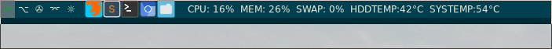

# Настройки для Awesome WM v4.2

> Общий вид (2 монитора)

> Левая часть верхней панели

> Правая часть верхней панели

В директории scripts всякие скрипты для удобств (файл настройки для них - scripts.conf):
* Скрипт-скриншотилка на яндекс диск - screen-*.sh, там 2 вида скрипта:
  1. Всего рабочего стола (screen_all.sh)
  2. Только выделенной части (screen_window.sh)

* Отключение тачпада - touch_on_off.sh
* Будильник - snakyalarm.sh
* Определение раскладки - key.sh (в 4 версии awesome уже не актуален, так как есть свой виджет в комплекте)
* Погода - weather.py. Берет погоду с api.openweathermap.org, нужен ключ авторизации.
* Блокировка экрана - i3lock_pix.sh (как видно из названия, юзает i3lock)
* Изменение яркости экрана - backlight-*.sh
